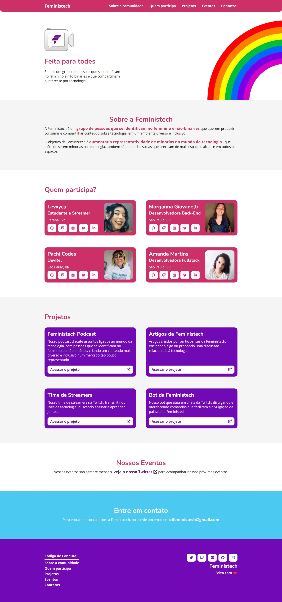

<p align="center">
    
    
</p>


# ⭐ Site oficial da Feministech

> Site oficial da Feministech, contendo informações sobre a comunidade, eventos, projetos, etc.

<details>
    <summary>Captura de tela do site oficial</summary>
    
</details>

## 🔎 Requisitos:

1. [Node LTS](https://nodejs.org/en/);
2. [Visual Studio Code](https://code.visualstudio.com/) ou outra IDE de sua preferência;
3. [GitHub Desktop](https://desktop.github.com/) para clonar e realizar os _commits_;
4. [Git](https://git-scm.com/) se preferir usar o _terminal_.

## ✅ Como começar:

1. Clone o repositório na sua máquina através do **GitHub Desktop** ou do comando `git clone`.

2. Criei uma branch próprio de trabalho para não realizar _commits_ diretamente na _branch_ principal.

3. Prepare o ambiente de desenvolvimento instalando as dependências, usando uma das opções abaixo:

```sh
npm install
# ou
yarn install
```

3. Inicie o site em modo de desenvolvimento local para visualizar as suas alterações em tempo real usando:

```sh
npm run dev
# ou
yarn dev
```

4. Assim que terminar os trabalhos, abra um _pull request_ para o _branch_ principal solicitando a revisão e aprovação de outra pessoa da comunidade para evitarmos erros que possam tirar o site do ar.

## 🚀 Como é feito o _deploy_?

Criamos um _workflow_ do **GitHub Actions** para automatizar a _build_ do site estático em **SvelteKit**, e o _deploy_ da nova versão em uma _branch_ separada para o **GitHub Pages** a cada nova _pull request_ aprovada.

Você pode encontrar informação sobre esse processo nos arquivos dentro da pasta de _workflows_.

## 📋 Como abrir uma _issue_:

**Encontrou algum bug ou tem alguma ideia e/ou sugestão?**

Fique à vontade para abrir uma _issue_ aqui no repositório, e sempre que possível use _labels_ e pense em um título objetivo para facilitar para quem estiver em busca de uma tarefa ou mesmo o entendimento dela.

## 📜 Licença

Este projeto está sob a licença MIT, clique [aqui](LICENSE.md) para saber mais.
